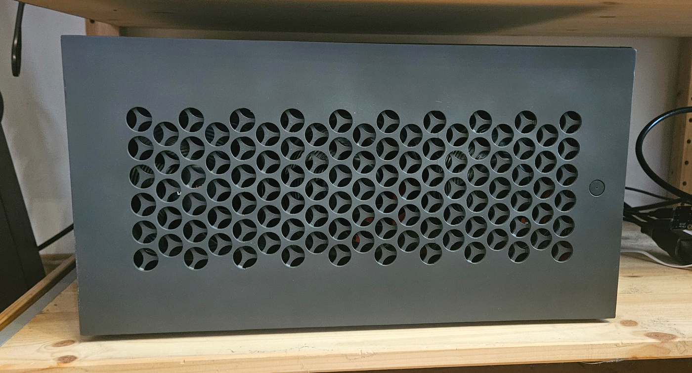
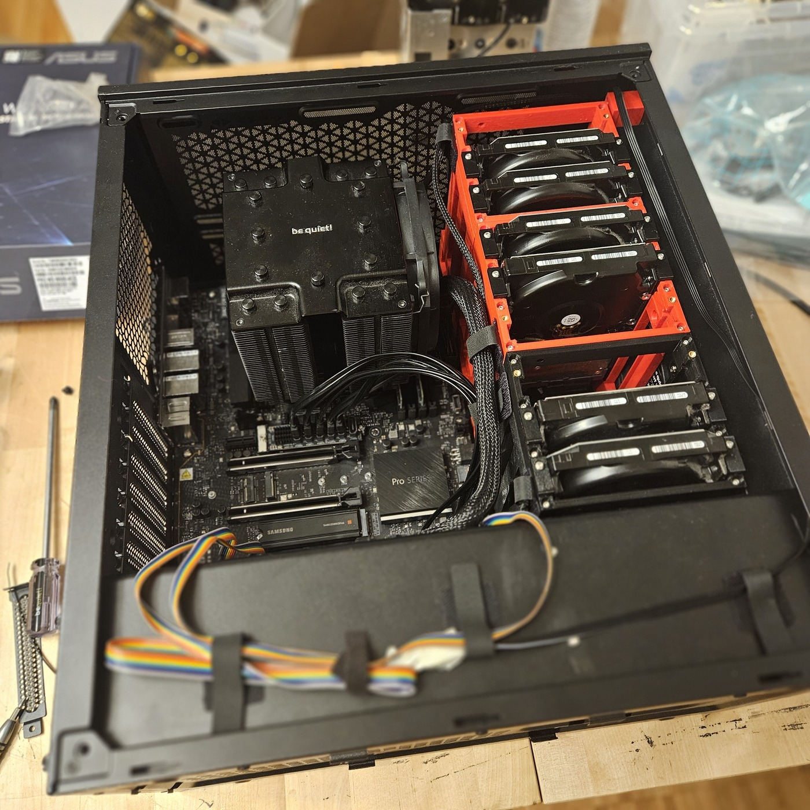

# Project Athena
DIY PC Case Modding for Datahoarders 

## Background

When I was looking to replace my Home NAS, I desperately searched for an affordable, usable, and good-looking PC case with enough capacity for all my disks. Unfortunately, nowadays it is even hard to get a PC case that does not have a glass panel, and even harder to find one without a PSU shroud.

In the end, I settled on buying a *be quiet! Pure Base 500* and making the needed modifications myself: meet Project Athena.

## Features

With the modifications, you can set up a PC with **7×2.5" + 9×3.5" disks** or up to **25×2.5" disks** (depending on configuration) while keeping a regular ATX motherboard and PSU.

